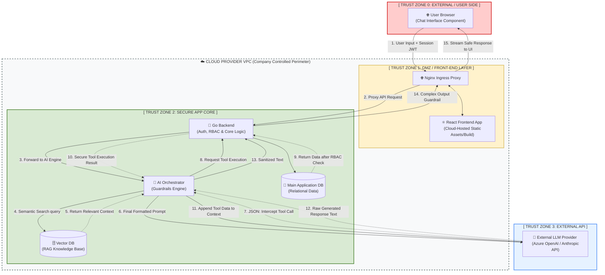

```mermaid
graph TB
    %% Style Definitions
    classDef untrusted fill:#ffcccc,stroke:#cc0000,stroke-width:2px;
    classDef dmz fill:#fff2cc,stroke:#d6b656,stroke-width:2px;
    classDef secure fill:#d9ead3,stroke:#38761d,stroke-width:2px;
    classDef external fill:#e6f2ff,stroke:#3b82f6,stroke-width:2px;

    %% ZONE 0: Client Side
    subgraph ZONE_0["[ TRUST ZONE 0: EXTERNAL / USER SIDE ]"]
        UserBrowser["🌐 User Browser <br> (Chat Interface Component)"]
    end
    class ZONE_0 untrusted;

    %% CLOUD PROVIDER VPC PERIMETER
    subgraph CLOUD_VPC["☁️ CLOUD PROVIDER VPC (Company Controlled Perimeter)"]
        style CLOUD_VPC fill:#f8f9fa,stroke:#7f8c8d,stroke-width:3px,stroke-dasharray: 5 5

        %% Front-end & Proxy in DMZ
        subgraph ZONE_1["[ TRUST ZONE 1: DMZ / FRONT-END LAYER ]"]
            Nginx["🌐 Nginx Ingress Proxy"]
            ReactApp["⚛️ React Frontend App <br> (Cloud-Hosted Static Assets/Build)"]
            Nginx <--> ReactApp
        end
        class ZONE_1 dmz;

        %% Application Core & AI Engine
        subgraph ZONE_2["[ TRUST ZONE 2: SECURE APP CORE ]"]
            GoBackend["🐹 Go Backend <br> (Auth, RBAC & Core Logic)"]
            GoOrchestrator["🤖 AI Orchestrator <br> (Guardrails Engine)"]
            
            VectorDB[("🗄️ Vector DB <br> (RAG Knowledge Base)")]
            AppDB[("💾 Main Application DB <br> (Relational Data)")]
        end
        class ZONE_2 secure;
    end

    %% External AI Provider
    subgraph ZONE_3["[ TRUST ZONE 3: EXTERNAL API ]"]
        ExternalLLM["🧠 External LLM Provider <br> (Azure OpenAI / Anthropic API)"]
    end
    class ZONE_3 external;

    %% ==========================================
    %% DATA FLOW
    %% ==========================================
    
    %% User Request into Cloud Frontend
    UserBrowser -- "1. User Input + Session JWT" --> Nginx
    
    %% Processing within Cloud Perimeter
    Nginx -- "2. Proxy API Request" --> GoBackend
    GoBackend -- "3. Forward to AI Engine" --> GoOrchestrator
    
    %% RAG Context Enrichment
    GoOrchestrator -- "4. Semantic Search query" --> VectorDB
    VectorDB -. "5. Return Relevant Context" .-> GoOrchestrator
    
    %% LLM Interaction
    GoOrchestrator -- "6. Final Formatted Prompt" --> ExternalLLM
    ExternalLLM -. "7. JSON: Intercept Tool Call" .-> GoOrchestrator
    
    %% Secure Tool Execution & Validation
    GoOrchestrator -- "8. Request Tool Execution" --> GoBackend
    GoBackend --> AppDB
    AppDB -. "9. Return Data after RBAC Check" .-> GoBackend
    GoBackend -. "10. Secure Tool Execution Result" .-> GoOrchestrator
    
    %% Final Response Generation
    GoOrchestrator -- "11. Append Tool Data to Context" --> ExternalLLM
    ExternalLLM -. "12. Raw Generated Response Text" .-> GoOrchestrator
    
    %% Safe Delivery with Guardrails
    GoOrchestrator -- "13. Sanitized Text" --> GoBackend
    GoBackend -- "14. Complex Output Guardrail" --> Nginx
    Nginx -- "15. Stream Safe Response to UI" --> UserBrowser
```
