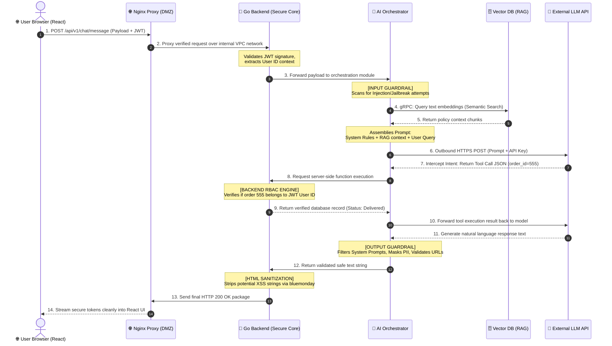

This section details how the structural zones isolate responsibilities and precisely how a user's chat message interacts with each security control in a sequential pipeline.

### 🛡️ Component Breakdown & Security Posture

* **Trust Zone 0 (External / Untrusted):** Contains the end-user's browser. It acts purely as a presentation layer rendering the React SPA. All inputs originating from this zone are treated as hostile and untrusted. No security validation or authorization checks are trusted if performed within this zone.
* **Trust Zone 1 (DMZ / Front-End Layer):** Houses the **Nginx Ingress Proxy** and serves the static builds of the **React Application**. Nginx acts as the fortress gate, handling TLS termination, enforcing global rate limits (DDoS mitigation), and cleanly routing authorized traffic into the private cloud network.
* **Trust Zone 2 (Secure App Core):** Completely isolated from the public internet with zero direct ingress routes. It contains the **Go Backend**, the **AI Orchestrator Engine**, the **Vector DB (e.g., Qdrant/Milvus)**, and the **Primary Relational DB**. Inter-service communication within this zone is strictly encrypted and verified via **gRPC with mTLS**.
* **Trust Zone 3 (External Third-Party API):** Governs outbound connections to managed external LLM endpoints. Security posture relies on API Key rotation, enterprise data-privacy contracts, and Data Loss Prevention (DLP) monitoring at the NAT Gateway egress point.

---

### 🔄 End-to-End Chat Message Data Flow

When a user interacts with the AI-powered chat component (e.g., sending the message: *“Check the status of my order #555 based on the refund policy”*), the operational sequence flows through the architecture as follows:

#### Detailed Step-by-Step Breakdown:

1.  **Ingress Request:** The user types a message in the chat interface. The **React SPA** packages the payload, injects the user's OAuth2/OIDC JWT token into the authorization header, and transmits it via HTTPS (TLS 1.3) to the **Nginx Ingress Proxy**.
2.  **Edge Verification:** Nginx intercepts the request, validates rate limits, ensures the packet payload sizes don't violate limits, and proxies the sanitized HTTP request over the private virtual cloud network directly to the **Go Backend**.
3.  **Authentication & Forwarding:** The **Go Backend** sanitizes the HTTP headers, validates the cryptographic signature of the incoming JWT token, extracts the immutable `user_id` context, and forwards the session data directly to the internal **AI Orchestrator Engine**.
4.  **Adversarial Input Inspection:** The **AI Orchestrator** immediately invokes the **Input Guardrails** engine. The text payload is systematically analyzed for direct prompt injection signatures, obfuscation tricks (such as Base64/Hex encoding bypasses), and system prompt extraction logic.
5.  **RAG Context Augmentation:** Once marked clean, the Orchestrator runs the text through an embedding model and executes a high-performance semantic search query via mTLS-backed gRPC to the **Vector DB**. The Vector DB isolates and returns structural chunks of the system's active knowledge base (e.g., specific corporate policies).
6.  **Prompt Engineering & Inference:** The Orchestrator combines the system instructions, the raw text inputs from the user, and the retrieved context documents into a rigid template using official model structural roles (`System`, `User`). This complete prompt is dispatched out of the VPC via a secure outbound gateway to the **External LLM Provider**.
7.  **Tool Call Hijacking Prevention:** The external model reads the prompt, recognizes the request for operational order details, and outputs an implicit intent to execute an integrated tool: `{"function": "GetOrderStatus", "arguments": {"order_id": "555"}}`. The Orchestrator halts execution at this step, strictly forbidding the external model from running arbitrary commands inside the core infrastructure.
8.  **Server-Side Access Control (RBAC):** The Orchestrator passes the tool signature to the **Go Backend**. The backend handles data interactions with the **Main Relational Database** by running an explicitly bounded query: `SELECT * FROM orders WHERE id = 555 AND user_id = <authenticated_id_from_JWT>`. If an attacker attempts an IDOR/BOLA exploit by forging the `order_id`, the relational query returns a structural `Null/Not Found` response, safely neutralizing the threat.
9.  **Response Synthesis:** The verified data object is passed back up through the Orchestrator, which appends the real-world operational result to the LLM's active context window. The model processes the unified state and emits a clear, natural language final response text.
10. **Defensive Output Sanitization:** Before delivering the generated text to the network interface, the Orchestrator processes the response against strict **Output Guardrails**. The code executes structural audits to verify that the LLM has not leaked internal system prompts, mistakenly revealed data fields containing PII, or hallucinated malicious Markdown reference links.
11. **Egress Delivery:** The Orchestrator pushes the clean response string back to the **Go Backend**, which passes it through an advanced HTML/JS entity encoder (using Go's `bluemonday` engine) to dynamically scrub the output of any script injection vulnerabilities (XSS) or breaking markdown formats. The clean payload is delivered to Nginx, which streams the raw, safe message string directly to the **React SPA** presentation layer.
