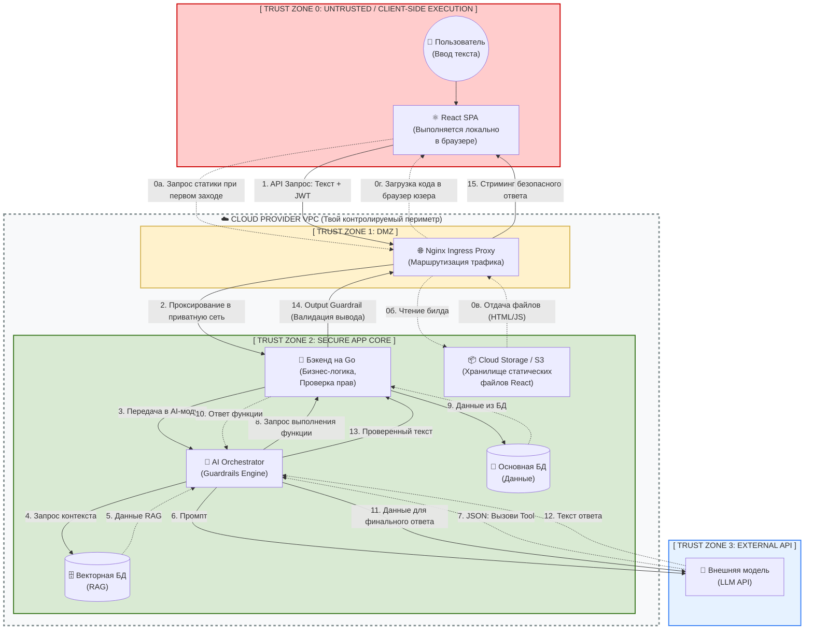

```mermaid
graph TB
    %% Настройка стилей
    classDef untrusted fill:#ffcccc,stroke:#cc0000,stroke-width:2px;
    classDef dmz fill:#fff2cc,stroke:#d6b656,stroke-width:2px;
    classDef secure fill:#d9ead3,stroke:#38761d,stroke-width:2px;
    classDef external fill:#e6f2ff,stroke:#3b82f6,stroke-width:2px;

    %% ZONE 0: Компьютер пользователя
    subgraph ZONE_0["[ TRUST ZONE 0: UNTRUSTED / CLIENT-SIDE EXECUTION ]"]
        User(("👤 Пользователь <br> (Ввод текста)"))
        ReactSPA["⚛️ React SPA <br> (Выполняется локально в браузере)"]
        User --> ReactSPA
    end
    class ZONE_0 untrusted;

    %% ГРАНИЦА ОБЛАКА
    subgraph CLOUD_VPC["☁️ CLOUD PROVIDER VPC (Твой контролируемый периметр)"]
        style CLOUD_VPC fill:#f8f9fa,stroke:#7f8c8d,stroke-width:3px,stroke-dasharray: 5 5

        subgraph ZONE_1["[ TRUST ZONE 1: DMZ ]"]
            Nginx["🌐 Nginx Ingress Proxy <br> (Маршрутизация трафика)"]
        end
        class ZONE_1 dmz;

        subgraph ZONE_2["[ TRUST ZONE 2: SECURE APP CORE ]"]
            GoBackend["🐹 Бэкенд на Go <br> (Бизнес-логика, Проверка прав)"]
            GoOrchestrator["🤖 AI Orchestrator <br> (Guardrails Engine)"]
            
            VectorDB[("🗄️ Векторная БД <br> (RAG)")]
            AppDB[("💾 Основная БД <br> (Данные)")]
            
            %% Вот где код хранится физически в облаке
            CloudStorage["📦 Cloud Storage / S3 <br> (Хранилище статических файлов React)"]
        end
        class ZONE_2 secure;
    end

    subgraph ZONE_3["[ TRUST ZONE 3: EXTERNAL API ]"]
        ExternalLLM["🧠 Внешняя модель <br> (LLM API)"]
    end
    class ZONE_3 external;

    %% ==========================================
    %% ПОТОК ДАННЫХ
    %% ==========================================
    
    %% ПРОЦЕСС ИНИЦИАЛИЗАЦИИ (Скачивание фронта)
    ReactSPA -. "0а. Запрос статики при первом заходе" .-> Nginx
    Nginx -. "0б. Чтение билда" .-> CloudStorage
    CloudStorage -. "0в. Отдача файлов (HTML/JS)" .-> Nginx
    Nginx -. "0г. Загрузка кода в браузер юзера" .-> ReactSPA

    %% ХОД РАБОЧЕГО СООБЩЕНИЯ В ЧАТЕ
    ReactSPA -- "1. API Запрос: Текст + JWT" --> Nginx
    Nginx -- "2. Проксирование в приватную сеть" --> GoBackend
    GoBackend -- "3. Передача в AI-модуль" --> GoOrchestrator
    GoOrchestrator -- "4. Запрос контекста" --> VectorDB
    VectorDB -. "5. Данные RAG" .-> GoOrchestrator
    GoOrchestrator -- "6. Промпт" --> ExternalLLM
    ExternalLLM -. "7. JSON: Вызови Tool" .-> GoOrchestrator
    GoOrchestrator -- "8. Запрос выполнения функции" --> GoBackend
    GoBackend --> AppDB
    AppDB -. "9. Данные из БД" .-> GoBackend
    GoBackend -. "10. Ответ функции" .-> GoOrchestrator
    GoOrchestrator -- "11. Данные для финального ответа" --> ExternalLLM
    ExternalLLM -. "12. Текст ответа" .-> GoOrchestrator
    GoOrchestrator -- "13. Проверенный текст" --> GoBackend
    GoBackend -- "14. Output Guardrail (Валидация вывода)" --> Nginx
    Nginx -- "15. Стриминг безопасного ответа" --> ReactSPA
```
