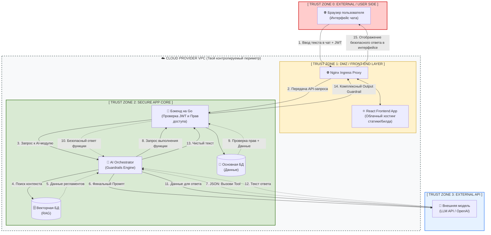

```mermaid
graph TB
    %% Настройка стилей
    classDef untrusted fill:#ffcccc,stroke:#cc0000,stroke-width:2px;
    classDef dmz fill:#fff2cc,stroke:#d6b656,stroke-width:2px;
    classDef secure fill:#d9ead3,stroke:#38761d,stroke-width:2px;
    classDef external fill:#e6f2ff,stroke:#3b82f6,stroke-width:2px;

    %% ZONE 0: Внешний мир (Только браузер как окно отображения)
    subgraph ZONE_0["[ TRUST ZONE 0: EXTERNAL / USER SIDE ]"]
        UserBrowser["🌐 Браузер пользователя <br> (Интерфейс чата)"]
    end
    class ZONE_0 untrusted;

    %% ГРАНИЦА ОБЛАКА (Все твои сервисы ТУТ)
    subgraph CLOUD_VPC["☁️ CLOUD PROVIDER VPC (Твой контролируемый периметр)"]
        style CLOUD_VPC fill:#f8f9fa,stroke:#7f8c8d,stroke-width:3px,stroke-dasharray: 5 5

        %% Front-end и Прокси в DMZ
        subgraph ZONE_1["[ TRUST ZONE 1: DMZ / FRONT-END LAYER ]"]
            Nginx["🌐 Nginx Ingress Proxy"]
            ReactApp["⚛️ React Frontend App <br> (Облачный хостинг статики/билда)"]
            Nginx <--> ReactApp
        end
        class ZONE_1 dmz;

        %% Сердце приложения и AI
        subgraph ZONE_2["[ TRUST ZONE 2: SECURE APP CORE ]"]
            GoBackend["🐹 Бэкенд на Go <br> (Проверка JWT и Прав доступа)"]
            GoOrchestrator["🤖 AI Orchestrator <br> (Guardrails Engine)"]
            
            VectorDB[("🗄️ Векторная БД <br> (RAG)")]
            AppDB[("💾 Основная БД <br> (Данные)")]
        end
        class ZONE_2 secure;
    end

    %% Внешний ИИ
    subgraph ZONE_3["[ TRUST ZONE 3: EXTERNAL API ]"]
        ExternalLLM["🧠 Внешняя модель <br> (LLM API / OpenAI)"]
    end
    class ZONE_3 external;

    %% ==========================================
    %% ПОТОК ХОДА СООБЩЕНИЯ (DATA FLOW)
    %% ==========================================
    
    %% Запрос из браузера во фронтенд облака
    UserBrowser -- "1. Ввод текста в чат + JWT" --> Nginx
    
    %% Обработка внутри облака
    Nginx -- "2. Передача API-запроса" --> GoBackend
    GoBackend -- "3. Запрос к AI-модулю" --> GoOrchestrator
    
    %% RAG цикл
    GoOrchestrator -- "4. Поиск контекста" --> VectorDB
    VectorDB -. "5. Данные регламентов" .-> GoOrchestrator
    
    %% Работа с LLM
    GoOrchestrator -- "6. Финальный Промпт" --> ExternalLLM
    ExternalLLM -. "7. JSON: Вызови Tool" .-> GoOrchestrator
    
    %% Проверка прав в БД
    GoOrchestrator -- "8. Запрос выполнения функции" --> GoBackend
    GoBackend --> AppDB
    AppDB -. "9. Проверка прав + Данные" .-> GoBackend
    GoBackend -. "10. Безопасный ответ функции" .-> GoOrchestrator
    
    %% Финал генерации
    GoOrchestrator -- "11. Данные для ответа" --> ExternalLLM
    ExternalLLM -. "12. Текст ответа" .-> GoOrchestrator
    
    %% Возврат пользователю через фильтры
    GoOrchestrator -- "13. Чистый текст" --> GoBackend
    GoBackend -- "14. Комплексный Output Guardrail" --> Nginx
    Nginx -- "15. Отображение безопасного ответа в интерфейсе" --> UserBrowser
```
