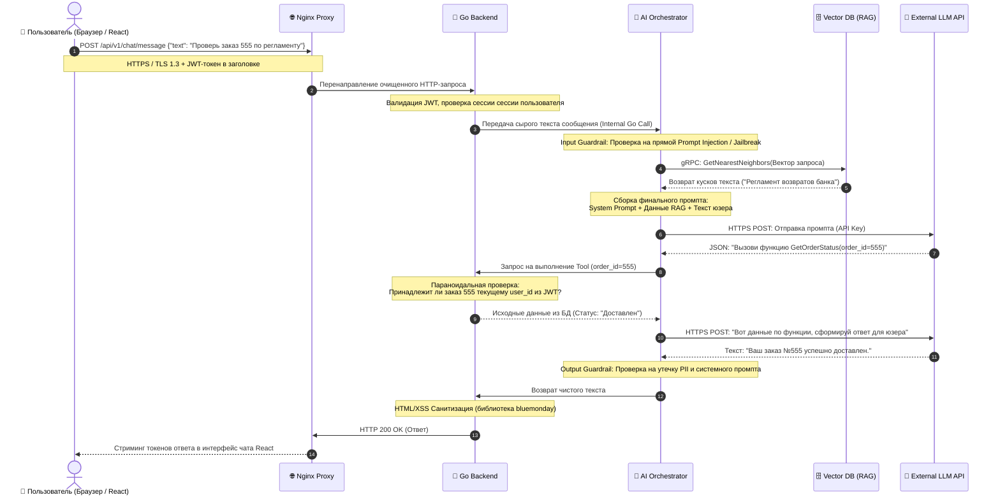

```mermaid
sequenceDiagram
    autonumber
    actor User as 👤 Пользователь (Браузер / React)
    participant Nginx as 🌐 Nginx Proxy
    participant GoBE as 🐹 Go Backend
    participant GoAI as 🤖 AI Orchestrator
    participant VDB as 🗄️ Vector DB (RAG)
    participant LLM as 🧠 External LLM API

    %% 1. Отправка сообщения
    User->>Nginx: POST /api/v1/chat/message {"text": "Проверь заказ 555 по регламенту"}
    Note over User,Nginx: HTTPS / TLS 1.3 + JWT-токен в заголовке

    %% 2. Проксирование и Аутентификация
    Nginx->>GoBE: Перенаправление очищенного HTTP-запроса
    Note over GoBE: Валидация JWT, проверка сессии сессии пользователя

    %% 3. Передача в AI-модуль и Входной контроль
    GoBE->>GoAI: Передача сырого текста сообщения (Internal Go Call)
    Note over GoAI: Input Guardrail: Проверка на прямой Prompt Injection / Jailbreak

    %% 4. Этап RAG (Обогащение контекста)
    GoAI->>VDB: gRPC: GetNearestNeighbors(Вектор запроса)
    VDB-->>GoAI: Возврат кусков текста ("Регламент возвратов банка")

    %% 5. Сборка промпта и отправка в модель
    Note over GoAI: Сборка финального промпта:<br>System Prompt + Данные RAG + Текст юзера
    GoAI->>LLM: HTTPS POST: Отправка промпта (API Key)

    %% 6. Tool Calling (Обратный вызов функции)
    LLM-->>GoAI: JSON: "Вызови функцию GetOrderStatus(order_id=555)"
    
    %% 7. Безопасное выполнение бизнес-логики
    GoAI->>GoBE: Запрос на выполнение Tool (order_id=555)
    Note over GoBE: Параноидальная проверка:<br>Принадлежит ли заказ 555 текущему user_id из JWT?
    GoBE-->>GoAI: Исходные данные из БД (Статус: "Доставлен")

    %% 8. Формирование финального ответа
    GoAI->>LLM: HTTPS POST: "Вот данные по функции, сформируй ответ для юзера"
    LLM-->>GoAI: Текст: "Ваш заказ №555 успешно доставлен."

    %% 9. Выходной контроль и возврат пользователю
    Note over GoAI: Output Guardrail: Проверка на утечку PII и системного промпта
    GoAI->>GoBE: Возврат чистого текста
    Note over GoBE: HTML/XSS Санитизация (библиотека bluemonday)
    GoBE->>Nginx: HTTP 200 OK (Ответ)
    Nginx-->>User: Стриминг токенов ответа в интерфейс чата React
```
