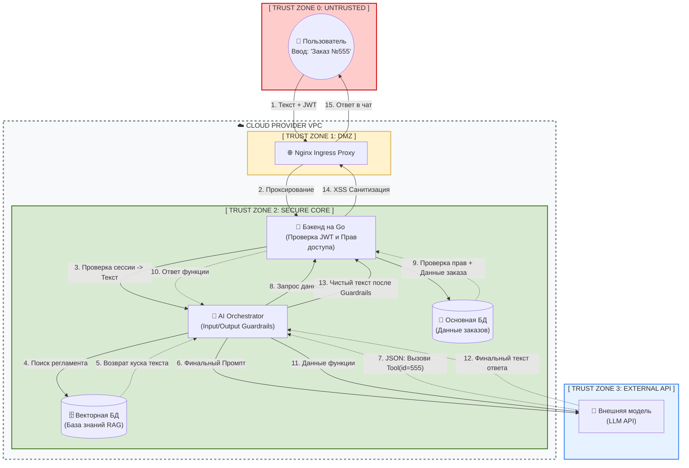

```mermaid
graph TB
    %% Настройка стилей для зон безопасности
    classDef untrusted fill:#ffcccc,stroke:#cc0000,stroke-width:2px;
    classDef dmz fill:#fff2cc,stroke:#d6b656,stroke-width:2px;
    classDef secure fill:#d9ead3,stroke:#38761d,stroke-width:2px;
    classDef external fill:#e6f2ff,stroke:#3b82f6,stroke-width:2px;

    %% ZONE 0: Браузер пользователя
    subgraph ZONE_0["[ TRUST ZONE 0: UNTRUSTED ]"]
        User(("👤 Пользователь <br> Ввод: 'Заказ №555'"))
    end
    class ZONE_0 untrusted;

    %% ГРАНИЦА ОБЛАКА
    subgraph CLOUD_VPC["☁️ CLOUD PROVIDER VPC"]
        style CLOUD_VPC fill:#f8f9fa,stroke:#7f8c8d,stroke-width:3px,stroke-dasharray: 5 5

        %% ZONE 1: Nginx
        subgraph ZONE_1["[ TRUST ZONE 1: DMZ ]"]
            Nginx["🌐 Nginx Ingress Proxy"]
        end
        class ZONE_1 dmz;

        %% ZONE 2: Защищенный контур (Бэкенд и AI)
        subgraph ZONE_2["[ TRUST ZONE 2: SECURE CORE ]"]
            GoBackend["🐹 Бэкенд на Go <br> (Проверка JWT и Прав доступа)"]
            
            GoOrchestrator["🤖 AI Orchestrator <br> (Input/Output Guardrails)"]
            
            VectorDB[("🗄️ Векторная БД <br> (База знаний RAG)")]
            AppDB[("💾 Основная БД <br> (Данные заказов)")]
        end
        class ZONE_2 secure;
    end

    %% ZONE 3: Внешний ИИ
    subgraph ZONE_3["[ TRUST ZONE 3: EXTERNAL API ]"]
        ExternalLLM["🧠 Внешняя модель <br> (LLM API)"]
    end
    class ZONE_3 external;

    %% ==========================================
    %% ПОТОК ХОДА СООБЩЕНИЯ (DATA FLOW)
    %% ==========================================
    
    %% Шаг 1-2: Текст летит в бэкенд
    User -- "1. Текст + JWT" --> Nginx
    Nginx -- "2. Проксирование" --> GoBackend
    
    %% Шаг 3: Бэкенд отдает в оркестратор
    GoBackend -- "3. Проверка сессии -> Текст" --> GoOrchestrator
    
    %% Шаг 4: Поиск контекста в RAG
    GoOrchestrator -- "4. Поиск регламента" --> VectorDB
    VectorDB -. "5. Возврат куска текста" .-> GoOrchestrator
    
    %% Шаг 5: Сборка промпта и отправка в модель
    GoOrchestrator -- "6. Финальный Промпт" --> ExternalLLM
    
    %% Шаг 6: Модель просит вызвать функцию (Tool Calling)
    ExternalLLM -. "7. JSON: Вызови Tool(id=555)" .-> GoOrchestrator
    
    %% Шаг 7: Оркестратор просит бэкенд выполнить функцию БЕЗОПАСНО
    GoOrchestrator -- "8. Запрос данных" --> GoBackend
    GoBackend --> AppDB
    AppDB -. "9. Проверка прав + Данные заказа" .-> GoBackend
    GoBackend -. "10. Ответ функции" .-> GoOrchestrator
    
    %% Шаг 8: Пересборка ответа через модель
    GoOrchestrator -- "11. Данные функции" --> ExternalLLM
    ExternalLLM -. "12. Финальный текст ответа" .-> GoOrchestrator
    
    %% Шаг 9: Возврат пользователю
    GoOrchestrator -- "13. Чистый текст после Guardrails" --> GoBackend
    GoBackend -- "14. XSS Санитизация" --> Nginx
    Nginx -- "15. Ответ в чат" --> User
```
